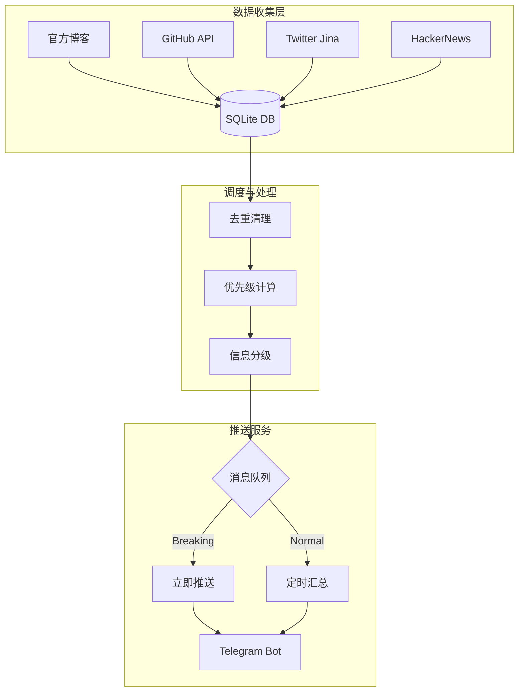

# 🎯 Silicon Valley Alpha Radar

> **监控 AI 界顶级大佬的"隐性共识"和潜在趋势，发现信息不对称优势。**

Silicon Valley Alpha Radar 是一个智能信息收集和推送系统，专注于追踪硅谷顶级 AI 实验室（OpenAI、Anthropic、DeepMind）及关键人物的最新动态，并通过 Telegram 实时推送结构化情报。

---

## 🚀 项目状态

**当前版本：Alpha 0.2**

### ✅ 已实现功能
- **多源数据收集**：
  - 🟢 **官方博客**：OpenAI, Anthropic, DeepMind, Google AI, Meta AI (基于 RSS/网页解析)
  - 📦 **GitHub**：监控指定组织的 Releases 和仓库动态
  - 🐦 **Twitter/X**：官方账号及关键人物（@sama, @karpathy 等）监控 (基于 Jina CLI，实验性)
- **智能调度系统**：
  - 支持后台守护进程 (`--daemon`)，默认每 6 小时自动执行收集
  - 每日定时（09:00）发送日报
  - 自动去重与过期数据清理
- **推送服务**：
  - **Telegram Bot** 集成
  - 支持 **BREAKING** (紧急) / **Summary** (汇总) 多种消息格式
  - 消息分级队列管理 (Urgent/Hourly/Normal)

### 🚧 开发中/待优化
- Twitter 数据收集的稳定性（依赖 Jina CLI，受限于反爬策略）
- Hacker News & Reddit 数据源的深度整合
- 统一数据库架构的合并 (`collected_articles.db` vs `unified_activities.db`)
- 完整的语义分析与“隐性共识”检测算法

---

## 🛠️ 技术架构

系统分为 **数据收集层**、**调度层** 和 **推送服务层**。



---

## 📂 项目结构

```text
silicon-valley-alpha-radar/
├── config/
│   ├── config.json             # 主配置文件 (Telegram Token等)
│   ├── data_sources_config.py  # 数据源与优先级定义
│   └── push_config.json        # 推送策略配置
├── docs/                       # 使用指南、数据文档、项目报告
├── src/
│   ├── collectors/             # 核心数据收集模块
│   │   ├── official_blog_collector.py
│   │   ├── github_release_collector.py
│   │   └── ...
│   ├── services/               # 服务层 (Unified Push)
│   ├── queues/                 # 消息队列管理
│   └── judges/                 # 信息价值判断逻辑
├── storage/                    # 数据库存储
├── scheduler.py                # 🚀 主调度程序 (入口)
├── collect_all_sources.py      # 数据收集核心脚本
├── collect_twitter.py          # Twitter 收集脚本
├── legacy/                     # 历史实验与测试脚本归档（不参与主流程）
└── requirements.txt            # Python 依赖
```

---

## 当前版本说明

当前版本以“稳定运行”为目标，目录与入口已经统一为主流程优先。

### ✅ 当前推荐入口
- `python scheduler.py`（标准采集与推送流程）
- `python scheduler.py --daemon`（后台持续运行）
- `python src/services/unified_push_service.py --start`（统一推送服务）

### 📦 目录分层
- `src/`：核心业务代码（collectors / services / queues / judges）
- `config/`：运行配置与策略配置
- `docs/`：使用指南、数据文档、架构与发布文档
- `legacy/`：历史脚本归档（不参与当前主流程）

### 🔒 维护原则
- 新功能优先在 `src/` 下模块化实现
- 根目录仅保留主入口与必要运行文件
- 历史脚本统一放在 `legacy/`，避免影响主流程可读性

## 📚 文档导航

- `docs/guides/`：安装、快速开始、服务说明、API 配置
- `docs/data/`：数据源设计与真实数据说明
- `docs/architecture/`：推送机制架构文档
- `docs/project/`：阶段进展与项目笔记
- `docs/release/`：发布与上传说明

## ⚡ 快速开始

### 1. 环境准备

```bash
# 克隆仓库
git clone https://github.com/PowerPuffri/silicon-valley-alpha-radar.git
cd silicon-valley-alpha-radar

# 创建并激活虚拟环境
python -m venv venv
source venv/bin/activate  # Mac/Linux
# venv\Scripts\activate   # Windows

# 安装依赖
pip install -r requirements.txt
```

### 2. 配置文件

复制 `config/config.json` 并填入你的 Telegram Bot 信息：

```json
{
  "telegram": {
    "botToken": "YOUR_BOT_TOKEN",
    "chatId": "YOUR_CHAT_ID"
  },
  "twitter": {
    "enabled": true
  }
}
```

### 3. 运行系统

#### 方式 A：标准调度模式 (推荐)
包含完整的收集、去重、推送流程。

```bash
# 单次运行（收集 + 推送）
python scheduler.py

# 后台守护模式（每 6 小时自动运行）
python scheduler.py --daemon

# 仅执行数据收集
python scheduler.py --collect
```

#### 方式 B：统一推送服务模式
适用于基于队列和优先级的持续推送服务。

```bash
# 启动持续监控服务
python src/services/unified_push_service.py --start

# 查看队列状态
python src/services/unified_push_service.py --status
```

---

## 📊 数据源与优先级

系统根据来源权威性和时效性计算优先级 (Priority Score)：

| 来源类型 | 权重 | 示例 |
|---------|------|------|
| **P0: Official Blog** | 100 | OpenAI Blog, Anthropic Research |
| **P0: Official X** | 90 | @OpenAI, @DeepMind |
| **P1: GitHub Release** | 85 | openai/gpt-4, pytorch/pytorch |
| **P1: Key Person** | 80 | @sama, @karpathy |
| **P2: Community** | 20 | Hacker News, Reddit (LocalLLaMA) |

---

> _"Information asymmetry is the ultimate leverage."_
